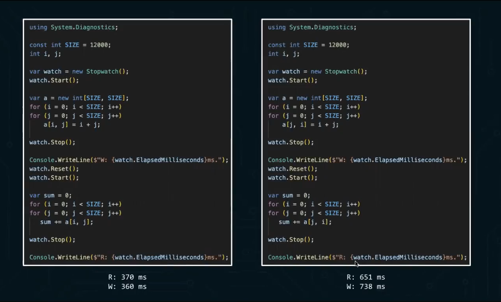
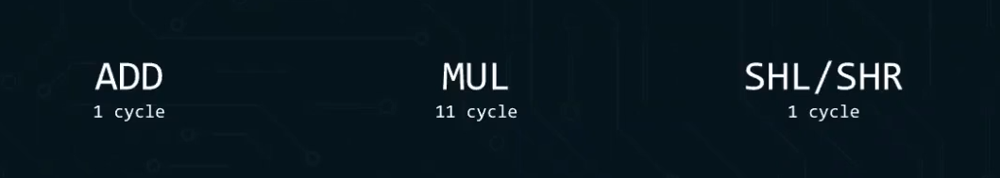
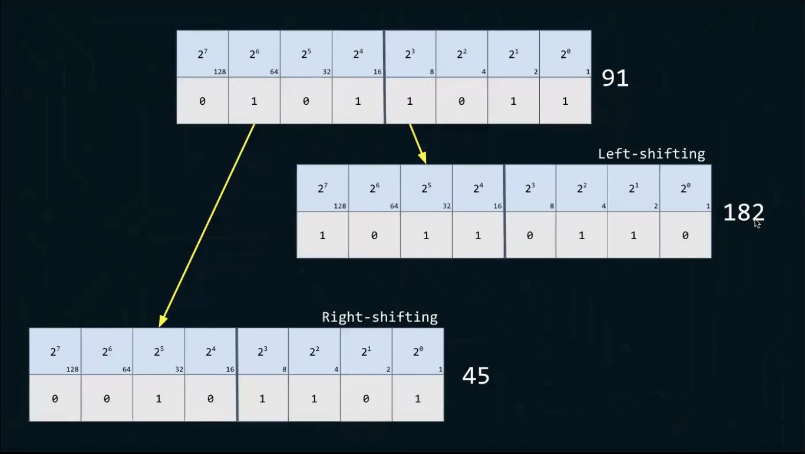
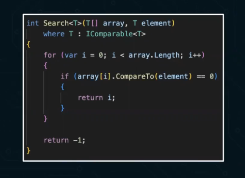
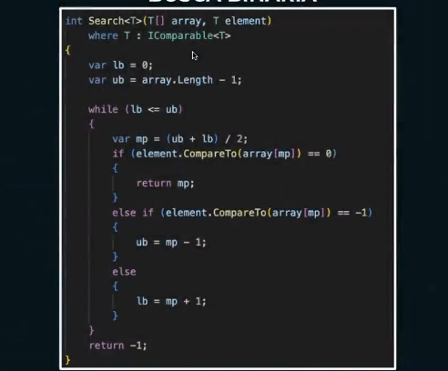
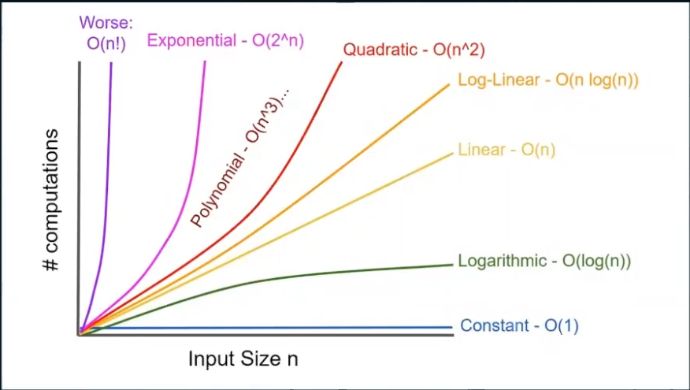

# Notas

- RAFT: algoritmo de sistema distribuídos;
- PAXOS: Algoritmos de sistemas distribuídos;
- Heurísticas e algoritmos de aproximação;

# Conceitos Fundamentais

## Classificação de problemas de decisão

- Solucionável em tempo polinomial ( P )
  - Quando se tem um problema solucionável em tempo polinomial, temos um problema que está no conjunto de **P**.
    - Ex.: verificar se um telefone existe em uma lista telefônica. Se a lista não está ordenada o tempo do algoritmo é linear $O(n)$, se estiver ordenada o algoritmo é $O(log n)$.

- Verificável em tempo polinomial ( NP )
  - Problemas que não são solucionáveis em **P** são verificáveis em **NP**.
    - Ex.: Sudoku
- NP-Hard
  - Ex.: Xadrez
- NP-Completo
  - Problema **C** está em **NP**. Todo problema **NP** é redutível para **C** em tempo polinomial.

Se eu posso resolver um problema em **P** também posso verificar em **NP**, logo todo algoritmo que faz parte do conjunto de **P** também faz parte do conjunto de **NP**.

# Alguns Algoritmos

Ordenar é importante, pois reduz o tempo das consultas.

O limite de performance de um algoritmo de ordenação é $O(nlogn)$.

## BUBBLESORT

- Pior caso: $O(n^2)$;
- Caso médio: $O(n^2)$;
- Melhor caso: $O(n)$.

Obs.: O BUBBLESORT tem esse nome porque os maiores elementos "sobem" para o topo do array como bolhas na água.

## QUICKSORT

- Pior caso: $O(n²)$;
- Caso médio: $O(n log n)$;
- Melhor caso: $O(n log n)$.

## MERGESORT

- Pior caso: $O(n log n)$
- Caso médio: $O(n log n)$;
- Melhor caso: $O(n log n)$.
  
## HEAPSORT

- Pior caso: $O(n log n)$
- Caso médio: $O(n log n)$;
- Melhor caso: $O(n log n)$.

Combina algoritmo com estrutura de dados. Baseado na estrutura de dados "binary HEAP" (com propriedade HEAP-MAX).
O HEAPSORT tem uma representação em árvores, mas pode ser representada em array:

- O índice do nó-pai para o nó $j$ será $(j-1/2)$;
- O índice do nó-filho-esquerda para o nó $j$ será $(2*j)+1$;
- O índice do nó-filho-direito para o nó $j$ será $(2*j)+2$.

Uma **BINARy HEAP** pode ser "MIN HEAP" ou "MAX HEAP":

- **MIN HEAP**: o valor do nó-pai é menor que o valor dos nós-filhos;
- **MAX HEAP**: o valor do nó-pai é maior que o valor dos nós-filhos.

A **BINARY HEAP** é fundamental para implementar o HEAPSORT, além disso, ela é uma das principais alternativas para implementação de um **PIRORITY QUEUE**.

# Análise de Algoritmos e Notação Big O

Mesmo os algorítmos com mesmo Big O podem ter desempenhos diferentes:



Analisando os algoritmos acima, podemos  verificar que no algoritmo da esquerda estamos acessando `a[i, j]` e no da direita `a[j, i]` e essa pequena diferença pode impactar a performance dependendo de como os dados estão organizados na memória.

Isso acontece por causa da forma como a memória do computador armazena matrizes em C#: ela é organizada em row-major order (por linhas). Quando você acessa `a[i, j]` percorrendo primeiro o índice da linha e depois o da coluna, os dados são lidos em sequência na memória, aproveitando melhor o cache da CPU. Já quando você inverte e acessa `a[j, i]`, o acesso salta de um lugar para outro na memória, quebrando a localidade e tornando o algoritmo muito mais lento.

## Ciclos



Cada operação em assembly leva um número diferente de ciclos de clock para ser executada. Por exemplo, uma operação de adição pode levar 1 ciclo, enquanto uma multiplicação pode levar 3 ciclos. Isso significa que, mesmo que dois algoritmos tenham a mesma complexidade Big O, o número real de ciclos de clock necessários para executá-los pode variar significativamente dependendo das operações que eles realizam.

Podemos usar por exemplo usar alternativas para reduzir o número de ciclos, como por exemplo usar SHL (shift left) ao invés de multiplicação por 2:

```assembly
SHL EAX, 1 ; Equivalente a EAX = EAX * 2
```

E usar SHR (shift right) ao invés de divisão por 2:

```assembly
SHR EAX, 1 ; Equivalente a EAX = EAX / 2
```



## Buscas

Quantos passos são necessários para esse algoritmo completar?



A complexidade do algoritmo está relacionada com o tempo que você precisa pra processar e geralmente a resposta está relacionada com o pior caso.
No caso do exemplo a complexidade é $O(n)$ = linear.

Busca binária tem complexidade $O(log n)$, ou seja, a cada iteração o número de elementos que você tem que processar é reduzido pela metade:



### BUSCA LINEAR

- Pior caso: $O(n)$;
- Caso médio: $O(n)$;
- Melhor caso: $O(1)$.

### BUSCA BINÁRIA

- Pior caso: $O(log n)$;
- Caso médio: $O(log n)$;
- Melhor caso: $O(1)$.

### Notação Big O

- O(1) - Constante;
- O(log n) - Logarítmica;
- O(n) - Linear;
- O(n log n) - Linearítmica;
- O(n²) - Quadrática;
- O(2^n) - Exponencial;
- O(n!) - Fatorial;



Big-o não é suficiente para definir performance de um algoritmo. Algoritmos com mesma notação Big O podem ter desempenhos diferentes dependendo de fatores como acesso à memória, operações realizadas, entre outros.
